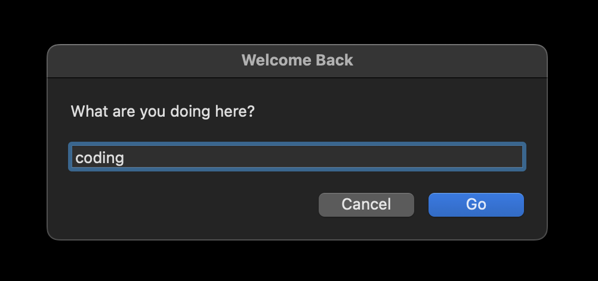

# hs-intention

This Hammerspoon module triggers a system dialog on unlock that prompts the user for their session intention. After the user enters an intention and clicks OK, a Watson frame is started with the intention as the project name.

## Usage
> [!IMPORTANT]
> Install [Hammerspoon](https://www.hammerspoon.org/) and [Watson](https://jazzband.github.io/Watson/)

To use my module, clone this repo and either rename it to .hammerspoon in your home directory or add the intention.lua file in modules to your existing .hammerspoon setup and copy the contents of init.lua into your init.lua file.
